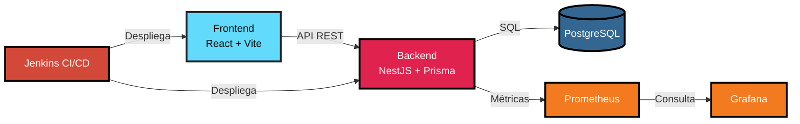
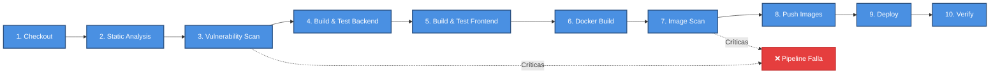

# Stock Management System - DevOps Complete

Sistema de gestión de stock con stack completo de DevOps: contenedorización, orquestación y CI/CD.

[](https://www.docker.com/)
[](https://kubernetes.io/)
[](https://www.jenkins.io/)

## 📋 Tabla de Contenidos

- [Descripción](#descripción)
- [Arquitectura](#arquitectura)
- [Tecnologías](#tecnologías)
- [Requisitos](#requisitos)
- [Inicio Rápido](#inicio-rápido)
- [Despliegue](#despliegue)
- [Análisis de Calidad](#análisis-de-calidad)
- [CI/CD Pipeline](#cicd-pipeline)
- [Monitoreo y Métricas](#monitoreo-y-métricas)
- [Documentación](#documentación)

## 🎯 Descripción

Sistema completo de gestión de inventario (stock) implementando las mejores prácticas de DevOps:

- **Contenedorización** con Docker (multi-stage builds optimizados)
- **Orquestación** con Kubernetes + Helm Charts
- **CI/CD** automatizado con Jenkins
- **Análisis de seguridad** con Trivy, Snyk y Semgrep
- **Análisis de imágenes** con Dive

### Componentes

- **Backend API**: NestJS + TypeScript + Prisma ORM
- **Frontend Web**: React + Vite + TypeScript  
- **Base de Datos**: PostgreSQL 16 (Alpine)

## 🏗️ Arquitectura



### Componentes Principales

#### Aplicación
- **Frontend**: React 18 + Vite 6 + TypeScript - Interfaz de usuario
- **Backend**: NestJS 10 + Prisma ORM - API REST
- **Base de Datos**: PostgreSQL 16 (Alpine) - Persistencia de datos

#### Monitoreo
- **Prometheus**: Recolección de métricas de aplicación y sistema
- **Grafana**: Visualización mediante dashboards personalizados

#### CI/CD
- **Jenkins**: Pipeline automatizado de build, test, scan y despliegue

## 🛠️ Tecnologías

### Backend
- NestJS 10.x
- TypeScript 5.x
- Prisma ORM 6.x
- PostgreSQL 16

### Frontend
- React 18.x
- Vite 6.x
- TypeScript 5.x

### DevOps
- **Containerización**: Docker, Docker Compose
- **Orquestación**: Kubernetes, Helm 3.x
- **CI/CD**: Jenkins
- **Seguridad**: Trivy, Snyk, Semgrep
- **Análisis**: Dive

## 📦 Requisitos

### Para Desarrollo Local
- Docker 20.x+
- Docker Compose 2.x+
- Node.js 20.x+ (opcional)

### Para Kubernetes
- Kubernetes 1.20+
- Helm 3.0+
- kubectl configurado

### Para CI/CD
- Jenkins 2.x+
- Plugins: Docker, Kubernetes CLI, Git, Snyk

## 🚀 Inicio Rápido

### 1. Con Docker Compose (Desarrollo Local)

```bash
# Clonar el repositorio
git clone <repository-url>
cd Entregable4DevOps-main

# Construir y levantar servicios
docker-compose up -d

# Verificar servicios
docker-compose ps

# Acceder
# Frontend: http://localhost:5173
# Backend:  http://localhost:3000
# Database: localhost:5432
```

### 2. Con Kubernetes + Helm

```bash
# Construir imágenes Docker
docker-compose build

# Desplegar en Kubernetes
helm install stock-management ./helm-chart \
  --values ./helm-chart/values-dev.yaml \
  --namespace development \
  --create-namespace

# Verificar despliegue
kubectl get all -n development

# Acceder a la aplicación
kubectl port-forward svc/stock-management-frontend 5173:5173 -n development
```

Ver [DEPLOYMENT.md](./DEPLOYMENT.md) para instrucciones detalladas.

## 📊 Análisis de Calidad

### Análisis de Imágenes Docker

Se realizó un análisis completo de calidad de las imágenes Docker:

```bash
# Escaneo de vulnerabilidades con Trivy
.\trivy.exe image entregable4devops-backend:1.0

# Análisis de capas con Dive
.\dive.exe entregable4devops-backend:1.0
```

#### Resultados del Análisis

| Métrica | Backend | Frontend |
|---------|---------|----------|
| Tamaño | 872 MB | 148 MB |
| Capas | 21 | 17 |
| Vulnerabilidades Críticas | 0 | 0 |
| Vulnerabilidades Altas | 2 | 3 |
| Multi-stage Build | ✅ | ✅ |
| Usuario no-root | ✅ | ✅ |

**Reporte completo**: [reports/image-analysis.md](./reports/image-analysis.md)

### Optimizaciones Implementadas

✅ Multi-stage builds para reducir tamaño  
✅ Imágenes base Alpine Linux (8 MB vs 150 MB)  
✅ Usuario no-root para mayor seguridad  
✅ npm cache clean para eliminar archivos temporales  
✅ .dockerignore para optimizar contexto de build  

### Mejoras Sugeridas

🔧 Migrar frontend de Node+serve a Nginx Alpine (reducción 80%)  
🔧 Evaluar eliminación de Prisma CLI global en backend  
🔧 Combinar comandos RUN para reducir capas  

## 🔄 CI/CD Pipeline

### Pipeline de Jenkins

El pipeline automatizado implementa un flujo completo de CI/CD con



### Etapas Detalladas del Pipeline

#### 1. Checkout
**Objetivo**: Obtener el código fuente del repositorio

**Acciones**:
- Clonación del repositorio Git mediante `checkout scm`
- Captura de información del commit (mensaje y autor)
- Establecimiento de variables de entorno para tracking

**Herramientas**: Git, Jenkins SCM Plugin

**Salida**: Código fuente disponible en el workspace de Jenkins

---

#### 2. Static Code Analysis
**Objetivo**: Detectar problemas de seguridad y calidad en el código fuente

**Acciones**:
- Instalación de Semgrep (si no está disponible): `pip3 install semgrep`
- Ejecución de análisis estático en `backend/` y `frontend/`
- Generación de reportes en formato JSON y texto plano
- Archivo de reportes como artefactos de Jenkins

**Herramientas**: 
- **Semgrep** (análisis estático de código)
- Configuración: `--config=auto` (reglas automáticas)

**Criterios de Éxito**:
- ✅ No se encuentran issues críticos (severity ERROR)
- ✅ **Pipeline FALLA** automáticamente si encuentra issues críticos

**Artefactos Generados**:
- `semgrep-report.json`
- `semgrep-report.txt`

---

#### 3. Dependency Vulnerability Scan
**Objetivo**: Identificar vulnerabilidades en dependencias de npm

**Acciones**:
- Autenticación con Snyk usando token de credenciales
- Escaneo de dependencias del backend (`backend/package.json`)
- Escaneo de dependencias del frontend (`frontend/package.json`)
- Análisis de severidad: solo vulnerabilidades HIGH y CRITICAL
- Archivo de reportes JSON

**Herramientas**: 
- **Snyk** (escaneo de vulnerabilidades en dependencias)
- Configuración: `--severity-threshold=high`

**Criterios de Éxito**:
- ✅ 0 vulnerabilidades críticas (CRITICAL)
- ⚠️ Máximo 5 vulnerabilidades altas (HIGH) permitidas
- ❌ **Pipeline FALLA** si encuentra vulnerabilidades críticas

**Artefactos Generados**:
- `snyk-backend-report.json`
- `snyk-frontend-report.json`

**Parámetros**:
- `SKIP_SECURITY_SCAN`: Permite omitir esta etapa (no recomendado)

---

#### 4. Build and Test Backend
**Objetivo**: Compilar y probar la aplicación backend

**Acciones**:
- Instalación de dependencias con `npm ci` (instalación limpia)
- Generación del cliente Prisma: `npx prisma generate`
- Ejecución de tests unitarios (si `SKIP_TESTS=false`)
- Generación de reporte de cobertura
- Compilación de TypeScript: `npm run build`

**Herramientas**: 
- **Node.js** 20.x
- **npm** (gestor de paquetes)
- **Prisma** (ORM)
- **Jest** (framework de testing)

**Criterios de Éxito**:
- ✅ Todas las dependencias se instalan correctamente
- ✅ Cliente Prisma se genera sin errores
- ✅ Tests pasan correctamente (el pipeline falla si hay errores)
- ✅ Compilación exitosa sin errores de TypeScript

**Artefactos Generados**:
- Código compilado en `backend/dist/`
- Reporte de cobertura en `backend/coverage/`
- Resultados de tests en formato JUnit XML

---

#### 5. Build and Test Frontend
**Objetivo**: Compilar y probar la aplicación frontend

**Acciones**:
- Instalación de dependencias con `npm ci`
- Ejecución de tests (si `SKIP_TESTS=false`)
- Compilación de la aplicación React con Vite: `npm run build`

**Herramientas**: 
- **Node.js** 20.x
- **npm** (gestor de paquetes)
- **Vite** (build tool)
- **React Testing Library** (testing)

**Criterios de Éxito**:
- ✅ Dependencias instaladas correctamente
- ✅ Tests pasan correctamente (el pipeline falla si hay errores)
- ✅ Build exitoso con assets optimizados

**Artefactos Generados**:
- Aplicación compilada en `frontend/dist/`

---

#### 6. Build Docker Images
**Objetivo**: Construir imágenes Docker optimizadas para producción

**Acciones**:
- Construcción de imagen backend: `docker build -t entregable4devops-backend:${BUILD_NUMBER}`
- Construcción de imagen frontend: `docker build -t entregable4devops-frontend:${BUILD_NUMBER}`
- Tagging de imágenes con `latest` y número de build
- Visualización de tamaños de imágenes

**Herramientas**: 
- **Docker** (construcción de imágenes)
- **Dockerfile** multi-stage (backend y frontend)

**Criterios de Éxito**:
- ✅ Imágenes construidas sin errores
- ✅ Tamaños de imágenes dentro de límites esperados

**Imágenes Generadas**:
- `entregable4devops-backend:${BUILD_NUMBER}` y `:latest`
- `entregable4devops-frontend:${BUILD_NUMBER}` y `:latest`

---

#### 7. Scan Docker Images
**Objetivo**: Escanear imágenes Docker en busca de vulnerabilidades

**Acciones**:
- Escaneo de imagen backend con Trivy
- Escaneo de imagen frontend con Trivy
- Generación de reportes JSON y salida en consola
- Análisis de severidad: CRITICAL y HIGH

**Herramientas**: 
- **Trivy** (escáner de vulnerabilidades en imágenes)
- Configuración: `--severity CRITICAL,HIGH`

**Criterios de Éxito**:
- ✅ Escaneo completado exitosamente
- ✅ **Pipeline FALLA** automáticamente si encuentra vulnerabilidades críticas
- ✅ Reportes JSON generados para análisis posterior

**Artefactos Generados**:
- `trivy-backend-image.json`
- `trivy-frontend-image.json`

**Parámetros**:
- `SKIP_SECURITY_SCAN`: Permite omitir esta etapa (no recomendado)

---

#### 8. Push Docker Images
**Objetivo**: Publicar imágenes en el registro Docker

**Acciones**:
- Autenticación en Docker Registry usando credenciales
- Tagging de imágenes para el registry: `${DOCKER_REGISTRY}/${IMAGE}:${TAG}`
- Push de imágenes con tag de build y `latest`

**Herramientas**: 
- **Docker** (push de imágenes)
- **Docker Registry** (almacenamiento de imágenes)

**Criterios de Éxito**:
- ✅ Autenticación exitosa en el registry
- ✅ Imágenes subidas correctamente

**Imágenes Publicadas**:
- `${DOCKER_REGISTRY}/entregable4devops-backend:${BUILD_NUMBER}`
- `${DOCKER_REGISTRY}/entregable4devops-frontend:${BUILD_NUMBER}`

---

#### 9. Deploy to Kubernetes
**Objetivo**: Desplegar la aplicación en Kubernetes usando Helm

**Acciones**:
- Configuración de contexto de Kubernetes (`KUBECONFIG`)
- Actualización de dependencias de Helm: `helm dependency update`
- Despliegue o actualización del release: `helm upgrade --install`
- Configuración según entorno (dev/prod) mediante `values-${ENV}.yaml`
- Espera de finalización del despliegue: `--wait --timeout 5m`

**Herramientas**: 
- **Helm** 3.x (gestor de paquetes de Kubernetes)
- **kubectl** (cliente de Kubernetes)

**Configuración**:
- Release name: `stock-management`
- Namespace: `default` (configurable mediante variable de entorno `HELM_NAMESPACE`)
- Valores: `values-dev.yaml` o `values-prod.yaml` según parámetro `ENVIRONMENT`
- Tags de imágenes: `${BUILD_NUMBER}`

**Criterios de Éxito**:
- ✅ Helm chart válido y sin errores
- ✅ Despliegue completado exitosamente
- ✅ Todos los recursos creados correctamente

**Parámetros**:
- `ENVIRONMENT`: `dev` o `prod` (selecciona archivo de valores)

---

#### 10. Verify Deployment
**Objetivo**: Verificar que el despliegue fue exitoso

**Acciones**:
- Espera de que los pods estén listos: `kubectl wait --for=condition=ready`
- Verificación del estado de pods
- Verificación de servicios desplegados
- Visualización del historial de Helm

**Herramientas**: 
- **kubectl** (verificación de recursos)
- **Helm** (historial de releases)

**Criterios de Éxito**:
- ✅ Todos los pods en estado `Ready`
- ✅ Servicios expuestos correctamente
- ✅ Release desplegado en el historial de Helm

**Verificaciones Realizadas**:
- Estado de pods: `kubectl get pods`
- Estado de servicios: `kubectl get svc`
- Historial de Helm: `helm history`

---

### Configuración del Pipeline

#### Variables de Entorno

| Variable | Descripción | Fuente |
|----------|-------------|--------|
| `DOCKER_REGISTRY` | URL del registro Docker | Credenciales Jenkins |
| `DOCKER_CREDENTIALS` | Credenciales de Docker | Credenciales Jenkins |
| `KUBECONFIG` | Configuración de Kubernetes | Credenciales Jenkins |
| `SNYK_TOKEN` | Token de autenticación Snyk | Credenciales Jenkins |
| `BACKEND_IMAGE` | Nombre de imagen backend | `entregable4devops-backend` |
| `FRONTEND_IMAGE` | Nombre de imagen frontend | `entregable4devops-frontend` |
| `IMAGE_TAG` | Tag de imagen | `${BUILD_NUMBER}` |
| `HELM_RELEASE` | Nombre del release Helm | `stock-management` |
| `HELM_NAMESPACE` | Namespace de Kubernetes | `default` |
| `DEPLOY_ENV` | Entorno de despliegue | `dev` o `prod` (según branch) |

#### Parámetros del Pipeline

| Parámetro | Tipo | Default | Descripción |
|-----------|------|---------|-------------|
| `ENVIRONMENT` | Choice | `dev` | Entorno de despliegue (`dev`, `prod`) |
| `SKIP_TESTS` | Boolean | `false` | Omitir ejecución de tests |
| `SKIP_SECURITY_SCAN` | Boolean | `false` | Omitir escaneos de seguridad (no recomendado) |

### Política de Seguridad

El pipeline **se detiene automáticamente** si detecta:

- ❌ **Vulnerabilidades críticas en dependencias** (Snyk)
  - Acción: Pipeline falla con error explícito
  - Mensaje: `"CRITICAL VULNERABILITIES FOUND: ${count} critical vulnerabilities detected. Pipeline aborted for security reasons."`
  - ⚠️ Warning si hay más de 5 vulnerabilidades HIGH (no bloquea pero alerta)

- ❌ **Vulnerabilidades críticas en imágenes Docker** (Trivy)
  - Acción: Pipeline falla automáticamente al detectar vulnerabilidades CRITICAL
  - Mensaje: `"CRITICAL VULNERABILITIES FOUND IN DOCKER IMAGES: ${count} critical vulnerabilities detected"`
  - Reportes JSON generados para análisis detallado

- ❌ **Issues críticos en análisis estático** (Semgrep)
  - Acción: Pipeline falla automáticamente si encuentra issues con severity ERROR
  - Mensaje: `"CRITICAL SECURITY ISSUES FOUND: ${count} critical issues detected in static analysis. Pipeline aborted for security reasons."`

- ❌ **Fallos en tests unitarios**
  - Acción: Pipeline falla automáticamente si los tests fallan
  - Backend: `npm run test -- --coverage` (falla si hay errores)
  - Frontend: `npm run test` (falla si hay errores)

### Post-Actions (Always)

Independientemente del resultado del pipeline:

- **Cleanup**: Eliminación de imágenes Docker antiguas (`docker image prune -f`)
- **Archive Artifacts**: Archivo de reportes JSON generados durante la ejecución

**Jenkinsfile completo**: [Jenkinsfile](./Jenkinsfile)

## 🔐 Seguridad

### Análisis de Vulnerabilidades

```bash
# Backend dependencies
cd backend
npm audit

# Frontend dependencies  
cd frontend
npm audit

# Docker images
trivy image entregable4devops-backend:1.0
trivy image entregable4devops-frontend:1.0
```

### Reportes de Seguridad

- [Backend Dockerfile](./reports/security/backend/backend_dockerfile.md)
- [Frontend Dockerfile](./reports/security/frontend/frontend_dockerfile.md)
- [Backend Dependencies](./reports/security/backend/backend_dependencies.md)
- [Frontend Dependencies](./reports/security/frontend/frontend_dependencies.md)
- [Trivy Scans](./reports/security/)

## 📚 Documentación

### Guías Principales

- **[DEPLOYMENT.md](./DEPLOYMENT.md)** - Guía completa de despliegue con Kubernetes y Helm
- **[helm-chart/README.md](./helm-chart/README.md)** - Documentación del Helm Chart
- **[reports/image-analysis.md](./reports/image-analysis.md)** - Análisis de calidad de imágenes

### Estructura del Proyecto

```
Entregable4DevOps-main/
├── backend/                    # API NestJS
│   ├── src/
│   ├── prisma/
│   ├── Dockerfile
│   └── package.json
├── frontend/                   # React App
│   ├── components/
│   ├── Dockerfile
│   └── package.json
├── helm-chart/                 # Helm Chart
│   ├── Chart.yaml
│   ├── values.yaml
│   ├── values-dev.yaml
│   ├── values-prod.yaml
│   └── templates/
│       ├── deployment-backend.yaml
│       ├── deployment-frontend.yaml
│       ├── deployment-postgresql.yaml
│       ├── service.yaml
│       ├── ingress.yaml
│       ├── configmap.yaml
│       └── secret.yaml
├── reports/                    # Análisis y reportes
│   ├── image-analysis.md
│   └── security/
├── docker-compose.yml
├── Jenkinsfile                 # Pipeline CI/CD
├── DEPLOYMENT.md              # Guía de despliegue
└── README.md
```

## 🧪 Testing

### Local con Docker Compose

```bash
# Levantar servicios
docker-compose up -d

# Ver logs
docker-compose logs -f backend

# Tests del backend
docker-compose exec api npm run test

# Detener servicios
docker-compose down
```

### Validar Helm Chart

```bash
# Windows
.\validate-helm.ps1

# Linux/macOS
chmod +x validate-helm.sh
./validate-helm.sh
```

## 📈 Monitoreo y Métricas

### Stack de Monitoreo

El proyecto implementa un stack completo de monitoreo utilizando **Prometheus** para la recolección de métricas y **Grafana** para su visualización.

#### Prometheus

Prometheus está configurado para recolectar métricas del backend NestJS mediante service discovery de Kubernetes. El backend expone un endpoint `/metrics` con métricas personalizadas y estándar.

**Configuración:**
- **Puerto**: 9090
- **Intervalo de scraping**: 15 segundos
- **Job**: `nestjs-backend`
- **Service Discovery**: Kubernetes Pod discovery

#### Grafana

Grafana está desplegado como servicio NodePort con un dashboard preconfigurado que muestra métricas clave de la aplicación.

**Acceso:**
```bash
# Port forward para acceder localmente
kubectl port-forward svc/stock-management-grafana 3000:80 -n development

# Acceder en navegador
# http://localhost:3000
# Usuario: admin / Contraseña: admin -> Actualizar al iniciar sesión
```

### Métricas Expuestas

#### Métricas de Aplicación (Personalizadas)

El backend expone las siguientes métricas personalizadas mediante Prometheus:

| Métrica | Tipo | Descripción | Labels |
|---------|------|-------------|--------|
| `stock_products_total` | Gauge | Total de productos en inventario | - |
| `stock_movements_total` | Counter | Total de movimientos de stock | `type` (IN, OUT) |

**Implementación:**
- Actualización automática cada 10 segundos desde la base de datos
- Inicialización al arrancar la aplicación
- Métricas disponibles en `/metrics` del backend

#### Métricas HTTP (Automáticas)

Métricas HTTP recolectadas automáticamente por el interceptor de métricas:

| Métrica | Tipo | Descripción | Labels |
|---------|------|-------------|--------|
| `http_requests_total` | Counter | Total de peticiones HTTP | `method`, `route`, `status_code` |
| `http_request_duration_seconds` | Histogram | Duración de peticiones HTTP | `method`, `route`, `status_code` |

**Buckets del Histogram**: `[0.005, 0.01, 0.025, 0.05, 0.1, 0.25, 0.5, 1, 2.5, 5, 10]` segundos

#### Métricas del Sistema (Default)

Prometheus recolecta automáticamente métricas estándar del proceso Node.js:

| Métrica | Descripción |
|---------|-------------|
| `process_cpu_seconds_total` | CPU utilizada por el proceso |
| `process_resident_memory_bytes` | Memoria residente del proceso |
| `process_start_time_seconds` | Tiempo de inicio del proceso |

### Dashboard de Grafana

El dashboard **"Stock Management Monitoring"** incluye los siguientes paneles:

#### 1. Requests per Second (RPS)
- **Tipo**: Time Series
- **Métrica**: `sum(rate(http_requests_total{job="nestjs-backend"}[1m])) by (pod)`
- **Descripción**: Muestra el número de peticiones por segundo agrupadas por pod
- **Actualización**: Cada 5 segundos

#### 2. Average Latency (ms)
- **Tipo**: Time Series
- **Métrica**: `sum(rate(http_request_duration_seconds_sum[5m])) by (pod) / sum(rate(http_request_duration_seconds_count[5m])) by (pod) * 1000`
- **Descripción**: Latencia promedio de las peticiones HTTP en milisegundos
- **Umbrales**: Verde (< 80ms), Rojo (≥ 80ms)

#### 3. CPU Usage by Pod
- **Tipo**: Time Series
- **Métrica**: `rate(process_cpu_seconds_total[1m])`
- **Descripción**: Uso de CPU por pod del proceso Node.js
- **Unidad**: Porcentaje

#### 4. Memory Usage by Pod
- **Tipo**: Time Series
- **Métrica**: `process_resident_memory_bytes`
- **Descripción**: Uso de memoria residente por pod
- **Unidad**: Bytes

#### 5. Total Products in Inventory
- **Tipo**: Stat Panel
- **Métrica**: `max(stock_products_total)`
- **Descripción**: Total de productos actuales en inventario
- **Actualización**: Último valor conocido

#### 6. Stock Movements by Type
- **Tipo**: Time Series
- **Métrica**: `sum(stock_movements_total) by (type)`
- **Descripción**: Movimientos de stock agrupados por tipo (IN/OUT)
- **Leyenda**: Muestra series separadas para cada tipo

#### 7. Recent Stock Movements Log
- **Tipo**: Table
- **Fuente**: PostgreSQL (datasource directo)
- **Query**: 
  ```sql
  SELECT
    m."createdAt" as "Time",
    p.name as "Product",
    m.type as "Type",
    m.quantity as "Quantity"
  FROM "Movement" m
  JOIN "Product" p ON m."productId" = p.id
  ORDER BY m."createdAt" DESC
  LIMIT 50
  ```
- **Descripción**: Tabla con los últimos 50 movimientos de stock

### Configuración de Prometheus

El ConfigMap de Prometheus está configurado para descubrir automáticamente los pods del backend:

```yaml
scrape_configs:
  - job_name: 'nestjs-backend'
    scrape_interval: 15s
    kubernetes_sd_configs:
      - role: pod
        namespaces:
          names:
            - development
    relabel_configs:
      - source_labels: [__meta_kubernetes_pod_label_app_kubernetes_io_component]
        action: keep
        regex: backend
      - source_labels: [__meta_kubernetes_pod_container_port_number]
        action: keep
        regex: "3000"
```

### Verificar Estado de Pods

```bash
# Ver todos los pods
kubectl get pods -n development

# Ver logs en tiempo real
kubectl logs -f -l app.kubernetes.io/component=backend -n development

# Describir pod
kubectl describe pod <pod-name> -n development

# Verificar endpoint de métricas
kubectl port-forward svc/stock-management-backend 3000:3000 -n development
curl http://localhost:3000/metrics
```

### Métricas de Recursos de Kubernetes

```bash
# CPU y memoria de pods
kubectl top pods -n development

# Recursos de nodos
kubectl top nodes

# Ver métricas de Prometheus directamente
kubectl port-forward svc/stock-management-prometheus 9090:9090 -n development
# Acceder a http://localhost:9090
```

## 🔄 Actualización

### Actualizar Despliegue

```bash
# Construir nuevas imágenes
docker-compose build

# Actualizar en Kubernetes
helm upgrade stock-management ./helm-chart \
  --values ./helm-chart/values-dev.yaml \
  --set backend.image.tag=1.1.0 \
  --set frontend.image.tag=1.1.0
```

### Rollback

```bash
# Ver historial
helm history stock-management -n development

# Rollback
helm rollback stock-management -n development
```

## 🛑 Desinstalación

```bash
# Docker Compose
docker-compose down -v

# Kubernetes
helm uninstall stock-management -n development
kubectl delete namespace development
```

## 🤝 Contribución

1. Fork el proyecto
2. Crear una rama feature (`git checkout -b feature/AmazingFeature`)
3. Commit cambios (`git commit -m 'Add some AmazingFeature'`)
4. Push a la rama (`git push origin feature/AmazingFeature`)
5. Abrir Pull Request

## 📝 Comandos Útiles

### Docker

```bash
# Construir imágenes
docker-compose build

# Listar imágenes
docker images | grep entregable4devops

# Analizar imagen con Dive
dive entregable4devops-backend:1.0

# Escanear con Trivy
trivy image entregable4devops-backend:1.0
```

### Helm

```bash
# Validar chart
helm lint ./helm-chart

# Template sin instalar
helm template stock-management ./helm-chart

# Ver valores actuales
helm get values stock-management -n development

# Ver manifest desplegado
helm get manifest stock-management -n development
```

### Kubectl

```bash
# Port forward
kubectl port-forward svc/stock-management-frontend 5173:5173 -n development

# Ejecutar comando en pod
kubectl exec -it <pod-name> -n development -- /bin/sh

# Ver eventos
kubectl get events -n development --sort-by='.lastTimestamp'
```

## 📞 Soporte

Para problemas o preguntas:
- Ver [Troubleshooting](./DEPLOYMENT.md#troubleshooting) en DEPLOYMENT.md
- Revisar [Issues](https://github.com/your-repo/issues)
- Consultar documentación de [Helm](https://helm.sh/docs/) y [Kubernetes](https://kubernetes.io/docs/)

## 📄 Licencia

Este proyecto es parte de un entregable académico de DevOps.

---

**Desarrollado con** ❤️ **para el curso de DevOps**

**Última actualización:** Noviembre 18, 2025
